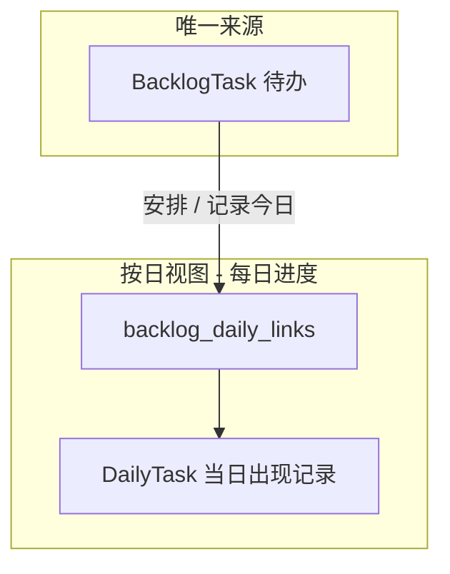
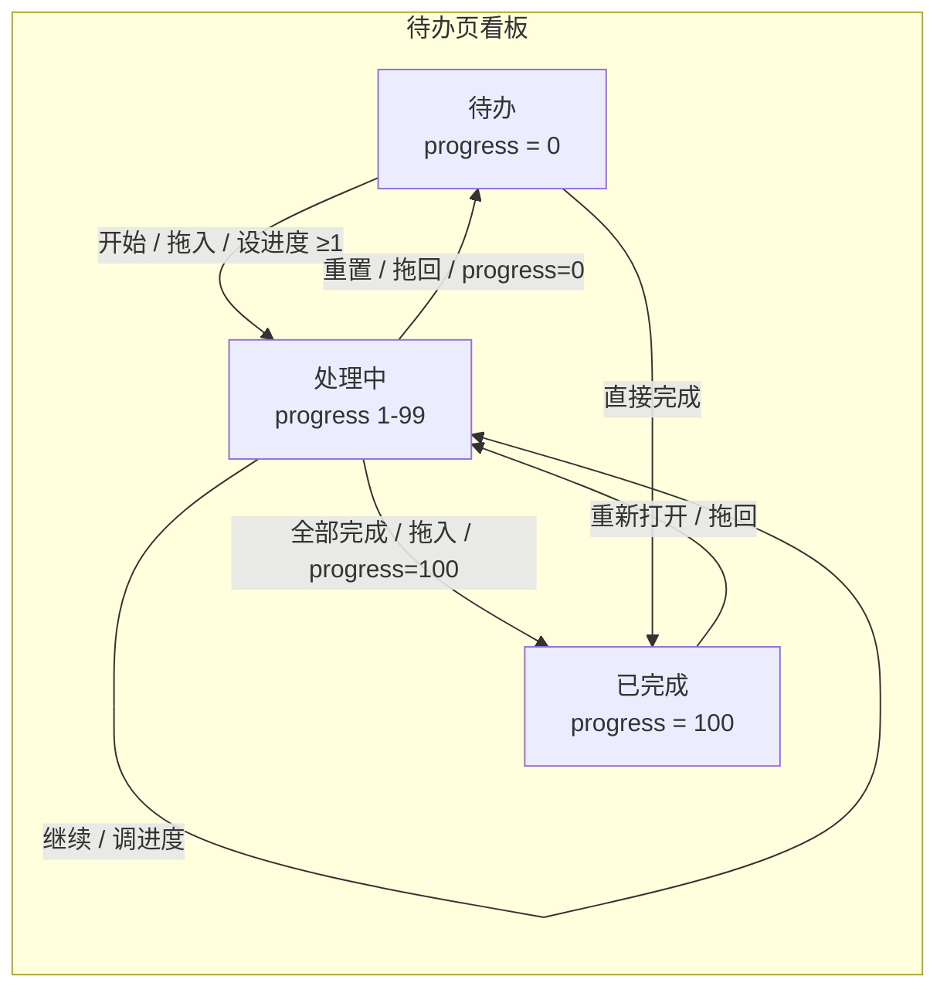

# 待办与每日进度统一模型 — 设计说明

**日期：** 2026-05-24  
**状态：** 草案（待评审）

## 1. 背景与问题

Fix Life 当前存在两套相关但**未完全连通**的任务数据：

| 存储 | 页面 | 角色 |
|------|------|------|
| `backlog_tasks` | **待办** | **唯一任务来源** + 三列看板（待办 / 处理中 / 已完成） |
| `daily_tasks` + link | **每日进度**（原「每日计划」） | 某天的执行/进度视图；仅展示已关联的待办出现记录 |

**现有同步（部分）：**

- 待办「安排到某天」→ 创建 `daily_task`，`backlog.status = scheduled`，写入 `backlog.daily_task_id`（**1:1**）。
- 待办「标记已完成」→ 在**当天**日计划创建/更新已完成任务并关联。
- 日计划任务状态变更 → 仅当已有 `daily_task_id` 反向更新 backlog（`sync_from_daily_task`）。
- 日计划**新建**任务 → **不**创建 backlog，待办页不可见（**本设计废除**：见 §3.4）。

**核心矛盾：**

1. **不是 1:1 关系**：同一待办可跨越多天出现在日计划中（例：「写设计文档」周一做一点、周三继续、周五收尾）。
2. **历史数据重复**：大量 backlog 与 daily 记录内容相同但未关联，待办页若简单合并会丢信息，若不合并则列表刷屏。
3. **完成语义不足**：仅有 `pending / scheduled / done` 无法表达「整体做了 50%，但今天还没全部做完」。

本设计定义：

1. **待办（Backlog）为唯一任务来源** — 所有任务必须先存在于待办，再「出现」在某天。
2. **按日视图**为待办在某自然日的**执行/进度切面**（Occurrence），不是第二套任务库。
3. 引入**整体进度**（0–100）与**三列看板**（待办 / 处理中 / 已完成）。

> **产品命名**：原「每日计划」强调事前规划，与「一切源自待办」的模型不符。推荐改名为 **「每日进度」**（见 §3.4）；实现阶段可统一改导航文案，数据库/API 路径 `daily_plans` 可暂保留。

---

## 2. 目标与非目标

### 2.1 目标

- **G1 单一来源**：**所有任务仅能在待办创建**；按日视图只能「安排到此日 / 记录今日进度」，不能产生独立任务。
- **G2 语义统一**：列表层待办**一行 = 一件工作**；按日视图**一行 = 该工作在某天的出现**。
- **G3 支持跨天**：一个 backlog 可关联**多条** daily（不同日期），在按日视图与待办详情时间线中展示。
- **G4 进度中间态 + 三列看板**：待办支持整体进度 `0–100`；看板分为**待办 / 处理中 / 已完成**，`1–99` 独占处理中列。
- **G5 历史可治理**：区分「真重复 orphan」与「合法跨天多次出现」；提供迁移与合并策略。
- **G6 按日视图可读**：展示当日关联待办的执行状态；卡片可跳转待办详情；详情展示**按日时间线**。

### 2.2 非目标

- 本版不改造**月计划**任务模型（可后续对齐）。
- 不引入子任务 / 自动进度推导（子任务计数 → %）——列为二期。
- 不要求日计划与待办字段 100% 镜像（如 `time_slot`、`estimated_minutes` 可仅存在于 daily）。
- 不在首期做「精确到 7%、83%」的自由滑块为主交互（以档位为主）。

---

## 3. 概念模型

### 3.1 两层语义



| 概念 | 说明 |
|------|------|
| **BacklogTask（待办）** | **唯一任务来源**；用户心中「一件事」；含 title/description/分类/优先级/**progress**。 |
| **DailyTask + Link** | 待办在**某一自然日**的出现记录；当天 todo/done；**不能**脱离 backlog 独立存在（新数据）。 |
| **每日进度页** | 按日期浏览「当天有哪些待办出现、当天推进如何」；不是第二个任务收件箱。 |

### 3.2 状态、进度与看板列（已定稿）

待办页采用 **三列看板**，列与 `progress` / `status` 一一对应：

| 看板列 | `status` | `progress` | 含义 |
|--------|----------|------------|------|
| **待办** | `pending` | `0` | 尚未开始或仅收录，未推进 |
| **处理中** | `in_progress` | `1–99` | 已着手，整体未完成（含跨天进行中） |
| **已完成** | `done` | `100` | 整体完成 |



**进度档位（首期 UI）：** `0 · 25 · 50 · 75 · 100`（对应未开始 / 四分之一 / 一半 / 大部分 / 完成）。选 `25/50/75` 时任务进入**处理中**列；选 `0` 回**待办**列；选 `100` 进**已完成**列。

**「已安排」标签（非独立列）：** 存在 link 且对应 daily 为 `todo`、且 `progress < 100` 时，在卡片上展示「已安排」小标签；该任务仍落在**待办**（progress=0）或**处理中**（progress≥1）列，取决于 progress，**不因安排而单独占列**。

> **废弃 `scheduled` 作为看板分列依据**（见 §8.1）：历史 `scheduled` 迁移时按 progress 归入待办或处理中；是否「已安排」仅作卡片标签。

**Daily 状态：** 保持 `todo | in-progress | done | cancelled`；首期同步逻辑仅使用 `todo` 与 `done`。

### 3.3 「完成」的两种层级

| 层级 | 操作 | 效果 |
|------|------|------|
| **当日完成** | 日计划勾选 ✅ | 该日 `daily_task.status = done`；**默认不**将 backlog progress 设为 100 |
| **整体完成** | 待办 progress → 100 或拖入「已完成」列 | `backlog.status = done`；进入**已完成**列；**可选**将**当天** linked daily 同步为 done |
| **标记进行中** | 待办 progress → 1–99 或拖入「处理中」列 | `backlog.status = in_progress`；进入**处理中**列 |

日计划勾选完成时：**弹窗询问整体进度**（推荐默认，见 §6.2）——选项：`保持不动 · 25% · 50% · 75% · 100%（全部完成）`。

### 3.4 单一来源原则与页面命名

#### 3.4.1 单一来源（已定稿）

**规则：**

1. **创建**：用户新建任务**只能在待办**完成；「每日进度」页**不能**产生脱离待办的任务。
2. **出现在某天**（每日进度页）：
   - **从待办挑选**：将已有待办「安排到该日」（写 link + daily）；
   - **快捷新建**：仍用 `TaskFormPanel` 创建待办，成功后**自动**写入当日 link（= 新建并安排到今天）。
3. **禁止**：新代码路径中仅写 `daily_tasks` 而不创建/关联 backlog；历史 orphan 靠迁移 backfill。

**收益：** 无双向 sync 歧义、无重复任务；待办 = 全量任务索引；每日进度 = 按日视图。

#### 3.4.2 页面命名建议

原 **「每日计划」** 暗示在该页规划任务，与单一来源不符。

| 名称 | 含义侧重 | 优点 | 缺点 |
|------|----------|------|------|
| **每日进度** ⭐ | 当天对各项待办的推进 | 与 progress 一致；含「做了但未完成」 | 「进度」略抽象 |
| **每日完成** | 当天完成了什么 | 复盘、打卡感强 | 进行中任务显得别扭 |
| **今日执行** | 当天执行清单 | 动作感强 | 略硬、略长 |
| **每日聚焦** | 当天关注哪些事 | 有产品感 | 与 progress 弱相关 |

**推荐：「每日进度」** — 与三列看板、`progress` 中间态同一套语言；也涵盖「今天推进到 50% 但未做完」。

**次选：「每日完成」** — 若更强调复盘而非进行中推进。

**实现：** UI/导航/导出文案改用选定中文名；代码 `DailyPlan` / `daily_plans` API **首期可不改**。

#### 3.4.3 每日进度页操作（取代原「添加任务」）

| 原交互 | 新交互 |
|--------|--------|
| 添加任务（独立创建） | **添到今日** → 待办选择器 +「新建待办」 |
| 勾选完成 | 更新当日出现 + 可选更新待办整体 progress |
| 删除当日条目 | 删 link + daily；**保留**待办 |

---

## 4. 数据模型

### 4.1 新增表 `backlog_daily_links`

| 列 | 类型 | 说明 |
|----|------|------|
| `id` | UUID PK | |
| `backlog_task_id` | UUID FK → backlog_tasks | ON DELETE CASCADE |
| `daily_task_id` | UUID FK → daily_tasks | ON DELETE CASCADE |
| `plan_date` | DATE | 冗余自 daily_plan，便于查询与迁移 |
| `created_at` | TIMESTAMP | |

**约束：**

- `UNIQUE (daily_task_id)` — 每条 daily 最多归属一个 backlog。
- `UNIQUE (backlog_task_id, plan_date)` — 同一待办在同一自然日最多一条 link（避免同日重复）；若需同日多次出现，二期再放宽。

**索引：** `(backlog_task_id)`, `(plan_date)`, `(backlog_task_id, plan_date)`。

### 4.2 `backlog_tasks` 变更

| 变更 | 说明 |
|------|------|
| 新增 `progress` | INTEGER，默认 `0`，CHECK `0 <= progress <= 100` |
| 新增 `origin` | VARCHAR：`inbox` \| `daily` \| `migrated`（可选，便于筛选与迁移审计） |
| **`daily_task_id`** | **废弃**（迁移数据至 link 表后删除列）；过渡期保留只读兼容 |

**`BacklogTaskStatus` 扩展：**

- 新增 `IN_PROGRESS = "in_progress"`。
- **`scheduled` 废弃写入**；迁移后只作历史只读，新数据用 `pending` + link 标签「已安排」（见 §8.1）。

### 4.3 `daily_tasks` 变更

| 变更 | 说明 |
|------|------|
| 新增 `backlog_task_id` | UUID FK nullable → backlog_tasks（可选冗余，与 link 表双向可查；**以 link 表为准**） |

### 4.4 关系示意

```
User
  ├── backlog_tasks (1:N)
  │       └── backlog_daily_links (1:N)
  │               └── daily_tasks (N:1)
  └── daily_plans (1:N)
          └── daily_tasks (1:N)
```

---

## 5. 同步服务（TaskSyncService）

所有跨表写操作收敛到 `TaskSyncService`（或扩展现有 `BacklogTaskService` + `DailyPlanService` 编排层），避免散落逻辑。

### 5.1 创建（单一来源）

| 入口 | 行为 |
|------|------|
| **待办页创建** | 写 `backlog_tasks`；progress/status 按表单；默认**不**写 daily（除非用户同时「安排到某日」）。 |
| **待办创建且 progress=100** | 写 backlog + **可选**当天 daily(done) + link。 |
| **每日进度 · 新建待办** | 同待办创建 API → 创建 backlog → **自动** link 到当前浏览日期 + daily(todo)。 |
| **每日进度 · 从待办挑选** | 不新建 backlog；对已有 backlog 写 link + daily(todo)。 |
| ~~日计划独立创建 daily~~ | **禁止**（§3.4.1） |

### 5.2 更新

| 入口 | 行为 |
|------|------|
| **待办 progress/status 变更** | 更新 backlog；progress 变更驱动**看板跨列**；若 progress=100，可选同步**最近一天**或**当天** linked daily 为 done。 |
| **待办标题/描述/分类/优先级** | 更新 backlog；**不**批量覆盖所有 daily（daily 保持历史快照）；可选「同步到未完成的 daily」开关（默认关）。 |
| **日计划更新 daily 字段** | 更新 daily；若该 daily 有 link，可选同步 backlog 非进度字段（默认仅 sync 状态，见下）。 |
| **日计划 daily → done** | daily.status=done；触发进度弹窗逻辑（§6.2）；不自动 100% 除非用户选择。 |

### 5.3 安排到某天（schedule）

- 若该 `(backlog_id, plan_date)` **已有 link**：不新建 daily，提示已安排在该日。
- 否则：create/merge daily plan → create daily(todo) → create link；backlog progress 不变；展示「已安排」。

### 5.4 删除

| 入口 | 行为 |
|------|------|
| **删除 daily** | 删除 link + daily；**不**删除 backlog（除非 UI 勾选「同时删除待办」）。 |
| **删除 backlog** | 删除 backlog + cascade links；daily 策略：**保留 daily 作为历史**（SET NULL link）或 cascade 删除 —— **推荐保留 daily、断 link**（实现可选配置，默认断 link 保留 daily）。 |

### 5.5 读路径

- **待办列表 API**：按看板列分 tab 查询（见 §9）；响应增加 `progress`、`occurrence_count`、`last_plan_date`、`linked_dates[]`（摘要，最多 N 条）、`is_scheduled`（是否展示「已安排」标签）。
- **待办详情 API**：backlog + `occurrences[]`（plan_date, daily_task_id, daily_status, daily_title）。
- **日计划列表**：保持现有 daily 维度；daily 响应**必须**带 `backlog_task_id`；无 link 的 daily 仅作迁移期只读。

**看板列与列表 tab 映射：**

| 前端列 id | API `tab` 参数 | 查询条件 |
|-----------|----------------|----------|
| `pending` | `pending` | `status = pending`（且 `progress = 0`） |
| `in_progress` | `in_progress` | `status = in_progress`（且 `1 <= progress <= 99`） |
| `done` | `done` | `status = done`（且 `progress = 100`） |

> 过渡期：旧 `tab=active` 可映射为 `pending + in_progress` 合并响应（仅兼容期）；新前端固定三列、三次并行请求或单次 `tab=all` + 前端分列（实现二选一，推荐**三 tab 并行**与现双 tab 模式一致）。

---

## 6. 前端设计

### 6.0 三列看板布局

```
┌──────────────┬──────────────┬──────────────┐
│ 待办      [+] │ 处理中        │ 已完成        │
│ progress=0   │ progress 1-99 │ progress=100 │
├──────────────┼──────────────┼──────────────┤
│ 卡片…       │ 卡片 + 进度条  │ 卡片（弱化）   │
└──────────────┴──────────────┴──────────────┘
```

- **列顺序**：待办 → 处理中 → 已完成（左到右，符合工作流）。
- **列头样式**：待办蓝顶、处理中琥珀/橙顶、已完成绿顶（与现「待办/已完成」配色体系延续）。
- **「+ 新增待办」按钮**：仅挂在**待办**列标题旁（新建默认 `progress=0`）；处理中/已完成列不提供新建入口。
- **匹配计数**：筛选结果 `N 条匹配` = 三列任务数之和。
- **空态**：每列独立「无匹配」提示。

**拖拽改列（DnD）与 progress 联动：**

| 拖放 | 效果 |
|------|------|
| 待办 → 处理中 | `progress = 25`（默认档位，若已有 1–99 则保留原值） |
| 待办 → 已完成 | `progress = 100`，触发完成 sync（§5.2） |
| 处理中 → 待办 | `progress = 0` |
| 处理中 → 已完成 | `progress = 100` |
| 已完成 → 处理中 | `progress = 50`（默认「重新打开」档位） |
| 已完成 → 待办 | `progress = 0`；清除 `completed_at` |

拖拽与表单改 progress 走同一套 PUT 逻辑，保证列位置与 progress 一致。

### 6.1 共享表单 `TaskFormPanel` 扩展

在现有字段（标题、描述、**状态/进度**、优先级、分类）上增加：

- **整体进度**：档位按钮 `0 · 25 · 50 · 75 · 100`。
- **状态展示（与看板对齐）**：表单中「状态」改为三档 — **待处理**（0）/ **处理中**（1–99，选档位）/ **已完成**（100）；与三列看板语义一致，不再仅「待处理 / 已完成」两档。
- **待办创建/编辑**：编辑 progress；变更后任务落入对应看板列。
- **日计划创建**：同表单；**必须先创建待办**再 link 到当日（§3.4.1）；不提供独立 daily-only 路径。

创建模式下**不展示**时间戳行（已实现）。

### 6.2 日计划「勾选完成」交互

1. 用户点击 daily 完成。
2. 若 daily 已 link 到 backlog 且 backlog.progress &lt; 100：弹出 **Ant Design Modal**：
   - 标题：「更新整体进度？」
   - 选项：保持当前 · 25% · 50% · 75% · **100% 全部完成**
   - 默认选中：保持当前（或 75%，实现时 A/B 可配置）
3. 若 daily 未 link：仍完成 daily；后台尝试 backfill link+backlog 或仅记录 orphan（与迁移策略一致）。

### 6.3 待办看板卡片

**待办列（progress = 0）：**

```
┌─────────────────────────────────────┐
│ 读 RFC 文档                     [中] │
│ 学习 · 待处理          [已安排]      │
└─────────────────────────────────────┘
```

- 不展示进度条（或展示空条 0%）；可有「已安排」标签。

**处理中列（progress 1–99）：**

```
┌─────────────────────────────────────┐
│ 优化 fixlife                   [高] │
│ 学习 · 处理中                        │
│ ████████░░░░░░░░░░  50%             │
│ 📅 3/20 · 3/21 · 3/22（3 天）        │
└─────────────────────────────────────┘
```

- **必须**展示进度条 + 百分比；`occurrence_count > 0` 时显示日期摘要（最多 3 个日期 + 「+N」）。
- 可有「已安排」标签。

**已完成列（progress = 100）：**

```
┌─────────────────────────────────────┐
│ 部署上线                       [中] │
│ 工作 · 已完成                        │
│ 完成于 3/22 14:32                    │
└─────────────────────────────────────┘
```

- 标题弱化样式；展示 `completed_at`；**不**按 daily 条数重复展示。

### 6.4 待办详情

新增 **「日计划记录」** 时间线区块：

| 日期 | 当天状态 | 操作 |
|------|----------|------|
| 2026-03-20 | 待办 | 跳转日计划 |
| 2026-03-21 | 待办 | 跳转日计划 |
| 2026-03-22 | 已完成 | 跳转日计划 |

### 6.5 筛选（首期可选，P2）

- **来源**：全部 / 收件箱创建 / 日计划同步。
- **重复**：默认隐藏已 merge 的 orphan（仅管理员或「数据修复」入口可见）。

---

## 7. 历史数据迁移

### 7.1 目标

- 将现有 `backlog.daily_task_id` 迁入 `backlog_daily_links`。
- 对**无 link** 的 daily 尝试匹配或 backfill backlog。
- 合并**真重复**，保留**合法跨天**多条 link。

### 7.2 匹配规则（优先级从高到低）

1. **已有 `daily_task_id`**：直接 insert link（`plan_date` 取自 daily_plan）。
2. **同用户 + 同标题 + 同 plan_date + 状态可映射**：建立 link；若两侧均存在且无 link → **合并为一条 backlog**，删除多余 backlog 或标记 merged（软删字段可选）。
3. **仅 daily 存在**：创建 backlog（`origin=migrated`，progress 由 daily.status 映射：done→100，否则 0）+ link。
4. **仅 backlog 存在**：保持不变。
5. **无法匹配**：保留 orphan；UI 可选「可能重复」提示（fuzzy：同标题 + 7 天内）。

### 7.3 状态映射（迁移用）

| daily.status | backlog.progress | backlog.status | 看板列 |
|--------------|------------------|----------------|--------|
| todo | 0 | pending | 待办 |
| in-progress | 50 | in_progress | 处理中 |
| done | 100 | done | 已完成 |

**历史 `scheduled` backlog：** 若 `progress = 0` → **待办**列；若已有日计划执行记录或人工判定已着手 → `progress = 25`，**处理中**列。

### 7.4 迁移脚本

- Alembic migration：建表、加列、数据 backfill、弃用 `daily_task_id`（分步：先双写，再读 link，再删列）。
- 提供 `dry-run` 模式输出：将 merge / create / skip 数量。
- **不在迁移中物理删除** daily 行，除非明确 duplicate 且用户策略允许（默认不删 daily，只 consolidate backlog）。

---

## 8. 实现待定项（实现前必须闭合）

### 8.1 `scheduled` 与 `in_progress` 并存策略

**决策（A，已定稿）：** DB 仅存 `pending | in_progress | done | cancelled`；**不再写入 `scheduled`**。「已安排」由 link 存在且 daily 为 todo **计算为卡片标签**；看板分列**仅**由 progress 决定（§3.2）。

迁移：原 `status = scheduled` 的记录按 progress 归入**待办**或**处理中**列，并保留 link 以显示「已安排」。

### 8.2 ~~日计划创建时是否自动合并同名 backlog~~（已废止）

单一来源下，「每日进度 · 新建」始终显式创建 backlog 再 link，**不再**从 daily 侧模糊合并同名项。挑选已有待办时按 id 精确关联。

### 8.3 日计划完成时 progress 弹窗默认值

**推荐：** 默认「保持当前」；用户显式选 100% 才整体完成。

---

## 9. API 变更摘要

| 方法 | 路径 | 变更 |
|------|------|------|
| GET | `/backlog-tasks/` | `tab` 扩展为 `pending \| in_progress \| done`（**废弃** `active`）；响应增加 `progress`, `occurrence_summary`, `is_scheduled` |
| GET | `/backlog-tasks/{id}` | 新增；含 `occurrences[]` |
| POST | `/backlog-tasks/` | 请求/响应增加 `progress`；服务端同步 `status` |
| PUT | `/backlog-tasks/{id}` | 同上；改 progress 后任务可能**跨列** |
| POST | `/daily-plans/{id}/tasks` | **改为**「添到该日」：body 含 `backlog_task_id`（挑选）或 backlog 创建字段（快捷新建）；禁止 orphan daily |
| PATCH | `/daily-plans/tasks/{id}/status` | 完成后触发 progress 流程（前端弹窗 + PUT backlog） |

**`tab` 查询语义（替换现 `active` / `done`）：**

| tab | SQL 过滤（示意） |
|-----|------------------|
| `pending` | `progress = 0` AND `status = pending` |
| `in_progress` | `progress BETWEEN 1 AND 99` AND `status = in_progress` |
| `done` | `progress = 100` AND `status = done` |

排序：`pending` / `in_progress` 按 `updated_at DESC`；`done` 按 `completed_at DESC, created_at DESC`（与现 done 列一致）。

**新增（可选 P1）：**

- `POST /backlog-tasks/{id}/occurrences` — 显式安排到某日。
- `GET /backlog-tasks/{id}/occurrences` — 时间线。

---

## 10. 分阶段交付

| 阶段 | 范围 | 验收 |
|------|------|------|
| **P0** | link 表 + 单一来源 API + progress 字段 + 每日进度「添到今日」 | 新数据无 orphan daily；跨天可建多条 link |
| **P1** | 迁移脚本 + 弃用 `daily_task_id` + TaskSyncService 收敛 | dry-run 报告合理；现有 schedule/complete 行为不退化 |
| **P2** | **三列看板** + 卡片进度条 + DnD 跨列 + 详情时间线 + 完成弹窗 + 表单三态 | UX 符合 §6 |
| **P3** | orphan 合并工具、fuzzy 重复提示 | 历史列表明显变短、无误删 |

---

## 11. 验收标准

1. 在**每日进度**页「添到今日」后，待办列表存在对应 backlog，且该日有一条 link；**不存在**仅 daily、无 backlog 的新数据。
2. 同一 backlog 在 3 个不同日期各有 daily 时，待办详情展示 **3 条**时间线记录。
3. **三列看板**：`progress=0` 仅在**待办**列；`progress=50` 仅在**处理中**列且展示进度条；`progress=100` 仅在**已完成**列。
4. 拖拽：待办 → 处理中 后 progress≥1；处理中 → 已完成 后 progress=100；已完成 → 处理中 后 progress 变为 50（或约定默认值）且离开已完成列。
5. **每日进度**页勾选完成且用户选「保持进度」时，backlog progress **不变**，daily 为 done；若 progress 为 1–99，任务仍在**处理中**列。
6. 迁移后，原 `daily_task_id` 关联可在 link 表查到；待办列表条数 ≤ 迁移前 backlog 条数 + backfill 新增（合并后应减少或持平）。
7. 删除**每日进度**当日条目**默认不**删除 backlog。
8. 「+ 新增待办」仅出现在**待办**列；**每日进度**页使用「添到今日」+ 待办选择器。
9. 导航文案显示 **「每日进度」**（或评审选定名），不再使用「每日计划」。

---

## 12. 风险与缓解

| 风险 | 缓解 |
|------|------|
| 迁移误合并不同任务 | 匹配加 `plan_date`；合并仅同标题+同日；提供 dry-run |
| 用户不更新 progress | 允许仅 daily 驱动；完成弹窗轻量提示 |
| 双写过渡期 bug | P0 双写 link + 旧字段；feature flag 切读路径 |
| 性能（occurrence 聚合） | 列表 API 用 SQL 聚合 `count`/`max(plan_date)`，避免 N+1 |

---

## 13. 后续（评审通过后）

1. 产品确认 §8 待定项（尤其 8.1 scheduled 策略、8.3 弹窗默认）。
2. 使用 **writing-plans** 产出分步实现计划。
3. 本文件为需求与设计基线；变更需更新本文并说明原因。

---

## 附录 A：与当前代码差异对照

| 现状 | 本设计 |
|------|--------|
| 看板两列：待办 / 已完成 | **三列**：待办 / 处理中 / 已完成 |
| 每日计划页可独立建任务 | **每日进度**页仅 link/安排待办；待办为唯一来源 |
| 页面名「每日计划」 | 推荐改名 **「每日进度」** |
| API `tab=active` 含 pending+scheduled | `tab=pending \| in_progress \| done` |
| `backlog.daily_task_id` 1:1 | `backlog_daily_links` 1:N |
| 每日计划页可独立建 daily | 每日进度页仅安排/链接待办；待办为唯一来源 |
| status 无 in_progress | progress 1–99 → in_progress → **处理中列** |
| 完成即 backlog done | 分层：daily done vs progress 100 |
| TaskFormPanel 状态两档 | 三档：待处理 / 处理中 / 已完成 + 进度档位 |

## 附录 B：参考文件

- `backend/app/models/backlog_task.py`
- `backend/app/models/daily_plan.py`
- `backend/app/services/backlog_task_service.py`
- `frontend/src/components/TaskFormPanel.tsx`
- `frontend/src/components/TodosList.tsx`
- `frontend/src/components/DailyPlanCard.tsx`
