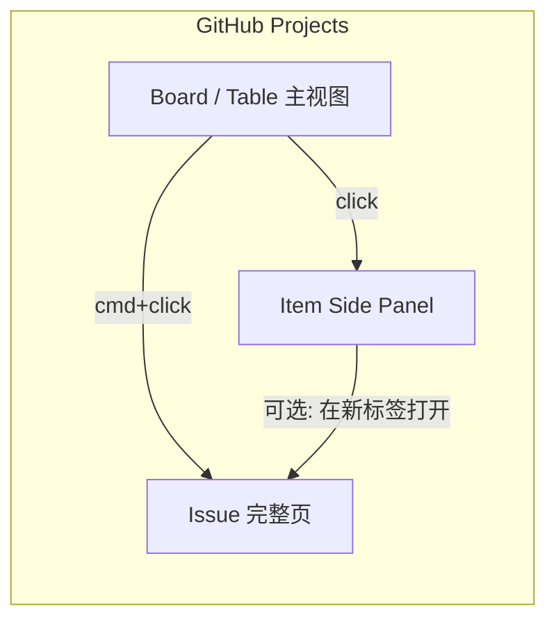
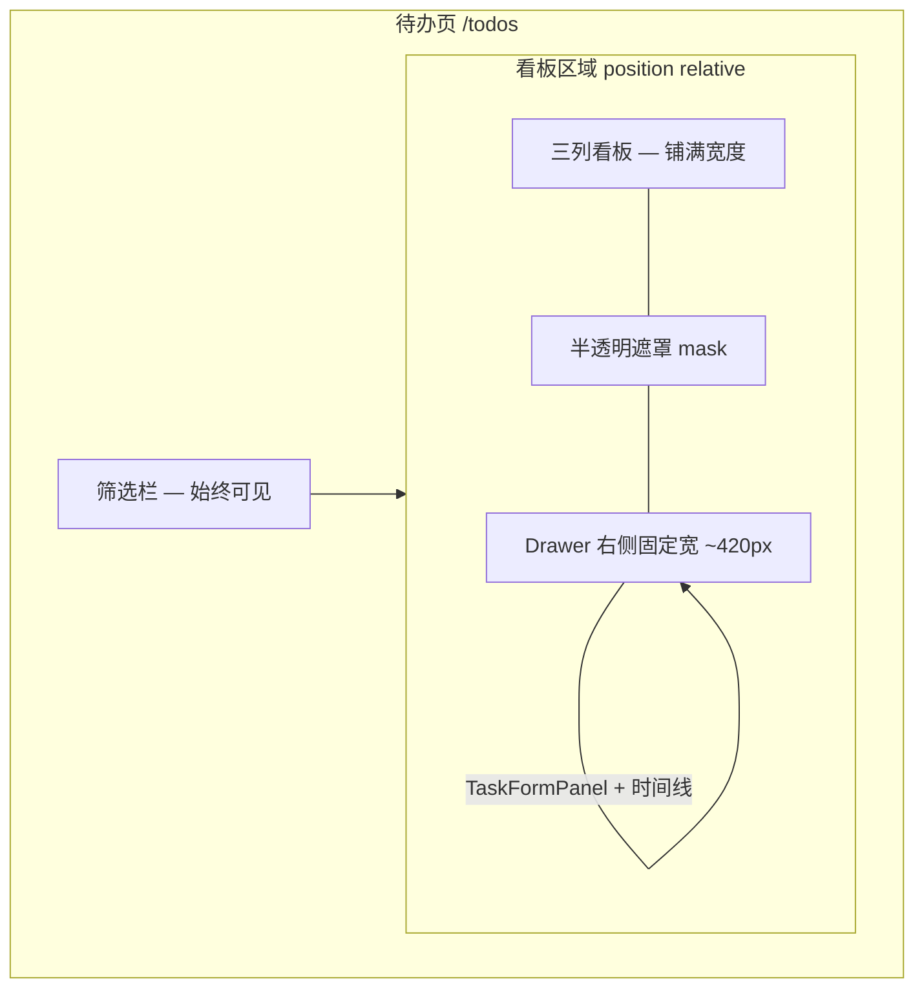

# 待办详情侧栏（GitHub Projects 模式）— 设计说明

**日期：** 2026-05-24  
**状态：** 草案（待评审）  
**参考：** [GitHub Projects Issue Side Panel](https://github.blog/changelog/2024-01-18-github-issues-projects-project-status-updates-issues-side-panel/) · [Roadmap #510](https://github.com/github/roadmap/issues/510) · [Deep link 至 side panel](https://github.blog/changelog/2023-01-05-github-issues-january-5th-update/)

---

## 1. 背景与问题

Fix Life **待办页**（`/todos`）采用三列看板（待办 / 处理中 / 已完成）。用户点击卡片时，详情在 **Ant Design Modal 弹窗** 中展示，包含：

- `TaskFormPanel`（标题、描述、分类、优先级、进度等）
- 「每日进度记录」时间线（`GET /backlog-tasks/{id}` 的 `occurrences`）

**当前弹窗的主要问题：**

| 问题 | 说明 |
|------|------|
| **打断上下文** | 居中 Modal + 全屏遮罩，与看板列表的「侧向展开」心智不符 |
| **空间不足** | 弹窗高度有限，时间线区域被压缩，与「跨天进度」信息密度不匹配 |
| **模式切换冗余** | 「查看 → 点编辑 → 保存 → 关闭」多一步；GitHub Projects 在侧栏内直接编辑 |
| **不可分享当前视图** | URL 不反映「正在查看哪条待办」，无法把「看板 + 选中项」一并发给他人或收藏 |
| **与产品心智不一致** | 待办是**列表/看板工作流**，详情是**叠加层**，居中弹窗更像一次性确认框 |

本设计参考 **GitHub Projects 点击 Issue 时的 Item Side Panel**，将待办详情从 Modal 改为 **右侧抽屉（Drawer）**，**覆盖**在三列看板之上（与 GitHub 一致，不要求看板与侧栏并排收窄）。

---

## 2. GitHub Projects 行为摘要（参考基准）

以下为 GitHub 官方公开行为，作为 Fix Life 交互对齐的**参考基准**（非 1:1 复制 UI）。

### 2.1 打开方式

| 用户操作 | GitHub Projects 行为 |
|----------|----------------------|
| **普通点击** board/table 中的 issue | 在 **Item Side Panel** 中打开；侧栏从右侧滑出，**覆盖**在项目视图之上（左侧可能仍露出部分 board，但不必并排分栏） |
| **⌘ + 点击**（Mac）/ **Ctrl + 点击**（Win/Linux） | 在**新标签页**打开 issue **完整页面**（repository issue URL） |
| **分享 URL** | 支持 **deep link**：复制地址栏 URL 可还原「项目视图 + 侧栏中打开的 item」([2023-01 changelog](https://github.blog/changelog/2023-01-05-github-issues-january-5th-update/)) |

> GitHub 明确说明侧栏是为「在项目里管理 issue」而设计，完整页仍保留给需要深度浏览的场景。([Roadmap #510](https://github.com/github/roadmap/issues/510))

### 2.2 侧栏内容（2022 → 2024 演进）

**2022 首版侧栏** ([2022-05 changelog](https://github.blog/changelog/2022-05-05-the-new-github-issues-may-5th-update/))：

- 编辑 title、description、labels、assignees、milestone
- 读/写 comments
- 编辑 **Project 自定义字段**（与 board 列字段同源）
- 从侧栏删除/归档 issue

**2024 更新** ([2024-01 changelog](https://github.blog/changelog/2024-01-18-github-issues-projects-project-status-updates-issues-side-panel/))：

- 侧栏 UI **与仓库 Issue 页一致**
- 包含 **完整 timeline events**
- 展示 issue 所属的 **其他 Projects**

### 2.3 设计原则（抽象）

1. **主视图不离开**：仍在 `/todos` 页面；详情是**覆盖层**（overlay），不是路由跳转。
2. **侧栏 = 完整能力**：侧栏内能完成日常 80% 操作，不必为了改标题而换页。
3. **深链可分享**：URL 编码「列表状态 + 当前 item」。
4. **高级路径保留**：Modifier 点击或显式入口仍可进入「完整页」。



---

## 3. Fix Life 方案概述

**采用：GitHub Projects 式 Item Side Panel（右侧抽屉）**

- 移除待办详情的 **Modal**
- 点击看板卡片 → **右侧 Drawer** 滑出（桌面约 400–480px 宽），**覆盖**三列看板区域（不要求看板收窄并排）
- 抽屉打开时，看板在视觉上可被抽屉 + 遮罩盖住；关闭抽屉后回到看板
- URL 同步：`/todos?task={backlog_task_id}`（与现有筛选参数 `q`、`context` 等共存）
- 侧栏内 **默认可编辑**（合并现有 view/edit 双模式为 inline 编辑 + 自动/显式保存）
- 「每日进度记录」作为侧栏下半区 **可滚动时间线**（对应 GitHub timeline）

**不采用（本版）：**

- 独立全页 `/todos/:id`（列为二期可选，见 §8）
- 卡片内联展开（与拖拽、多选、时间线冲突）

---

## 4. 目标与非目标

### 4.1 目标

- **G1 不离开待办页**：打开详情时仍停留在 `/todos`；抽屉**覆盖**看板即可（已确认，对齐 GitHub Projects overlay 模式）。
- **G2 深链**：`/todos?task=…` 刷新/分享后仍打开对应待办侧栏；关闭侧栏时移除 `task` 参数。
- **G3 编辑流畅**：侧栏内直接改字段；减少「查看 / 编辑」模式切换（对齐 GitHub 侧栏直接改字段的体验）。
- **G4 时间线可读**：「每日进度记录」在侧栏内有足够纵向空间，支持跳转 `/daily-plans?focus=YYYY-MM-DD`。
- **G5 键盘与无障碍**：`Esc` 关闭侧栏；焦点陷阱在侧栏内；关闭后焦点回到触发卡片。

### 4.2 非目标

- 本版不新增评论、@提及、reaction（GitHub 有，Fix Life 暂无）。
- 不改造「新增待办」「安排到每日进度」弹窗（仍用 Modal；安排已用内联 Calendar）。
- 不改造后端 API 形状（复用现有 `GET/PUT /backlog-tasks/{id}`）。
- 不在本版做 `/todos/:id` 独立路由（除非评审明确要求）。

---

## 5. 交互设计

### 5.1 布局（桌面 ≥ md）

**已定稿：抽屉覆盖看板（overlay），非并排分栏。**



| 区域 | 行为 |
|------|------|
| **筛选栏** | 抽屉打开时 **仍可见**（与 GitHub 项目顶栏类似，不在遮罩内） |
| **三列看板** | 抽屉打开时被 **遮罩 + 抽屉覆盖**；宽度 **不收窄**，不要求左侧露出可操作看板 |
| **Drawer** | Ant Design `Drawer`：`placement="right"`，`width={420}`（或 480），`mask={true}`，遮罩覆盖看板区域 |
| **遮罩点击** | 点击遮罩 → **关闭抽屉**并清除 URL `task`（标准 Drawer 行为） |

> **评审结论（2026-05-24）：** 允许抽屉覆盖三列看板，与 GitHub Projects 侧栏 overlay 一致，无需「看板左露 + 侧栏右窄」的分栏布局。

### 5.2 打开 / 关闭 / 切换

**已定稿：仅点击待办标题打开抽屉；卡片其他区域不触发。**

| 点击区域 | 行为 |
|----------|------|
| **待办标题**（`<p>` 标题文字） | 打开抽屉；`searchParams.task = id` |
| 分类 / 优先级标签 | **不**打开抽屉；优先级按钮仍切换优先级 |
| 进度条、日期、「已安排」等 meta | **不**打开抽屉 |
| 底部 **编辑 / 安排 / 删除** | **不**打开抽屉；各按钮保持原有动作（编辑可走侧栏或本版与「点标题」相同，见下） |
| 卡片空白 / 边框 / 拖拽区域 | **不**打开抽屉；拖拽仍仅在非多选模式下生效 |

> **「编辑」按钮（本版建议）：** 与点击标题相同 — 打开抽屉并进入可编辑态；不在卡片上单独弹 Modal。

| 操作 | 行为 |
|------|------|
| 点击 **标题** | 打开抽屉；`searchParams.task = id` |
| 抽屉已开且为同一 task | **不重复**触发打开动画 |
| **切换另一条待办** | 抽屉打开期间看板被覆盖，**本版**需先关闭抽屉再点另一条**标题**；或侧栏内上一条/下一条（二期） |
| 侧栏关闭按钮 / Esc / 点击遮罩 | 关闭抽屉；移除 URL `task` |
| 浏览器 **后退** | 依赖 URL 驱动关闭 |
| **⌘/Ctrl + 点击** **标题** | **本版可选**：新标签 `/todos?task={id}` |

**实现要点（KanbanCard）：**

- 标题使用 `cursor-pointer` + `onClick` → `openTaskDetail(task)`
- 卡片根节点 **移除** `onClick`；子控件 `stopPropagation` 保持现状
- 多选模式下：仅 **checkbox / 多选专用点击逻辑** 切换勾选，**标题点击也不打开抽屉**

### 5.3 URL 约定

与现有筛选参数兼容：

```
/todos?q=skills&context=learning&task=8df0c15f-fbe7-4bed-a119-98026de58e6e
```

| 参数 | 说明 |
|------|------|
| `task` | 当前侧栏打开的 `backlog_task.id`； absent 表示侧栏关闭 |
| 其他 | 沿用 `TodosFilterBar` 已有参数（`q`, `context`, `priority`, `time_field`, `date_from`, `date_to`） |

**规则：**

- 进入 `/todos?task=xxx`：加载列表后打开侧栏；若 id 不存在或无权限 → toast + 移除 `task`
- 筛选变更 **不** 自动关闭侧栏；若当前 `task` 被筛掉 → 侧栏仍显示该 task 详情（看板被遮罩盖住时用户主要在侧栏操作）

### 5.4 侧栏内容结构

```
┌─ Side Panel ─────────────────────┐
│ [×]  待办详情          [删除]     │  ← 顶栏：关闭、危险操作
├──────────────────────────────────┤
│ 标题（可编辑 input）              │
│ 分类 · 优先级 · 进度档位          │
│ 描述（textarea）                  │
│ 时间戳：创建 / 安排 / 完成        │
├──────────────────────────────────┤
│ 每日进度记录                      │
│ ┌ 日期 │ 当天状态 │ 跳转 ┐       │
│ │ ...  │ ...      │ ...  │       │
│ └────────────────────────┘       │
├──────────────────────────────────┤
│ [保存] 或 失焦自动保存（二选一）   │  ← 见 §5.5
└──────────────────────────────────┘
```

**与 GitHub 映射：**

| GitHub Side Panel | Fix Life Side Panel |
|-------------------|---------------------|
| Issue title / body | 标题 / 描述 |
| Labels | 分类 + 优先级 Pills |
| Project fields / Status | 进度档位 + 看板列（由 progress 推导） |
| Timeline (comments, events) | **每日进度记录**（occurrences） |
| Delete issue | 删除待办 |
| Open in new tab | （二期）新标签 `/todos?task=id` |

### 5.5 保存策略（待评审二选一）

| 方案 | 说明 | 推荐 |
|------|------|------|
| **A. 显式保存** | 底部「保存」；字段变更后 enabled | 与现 Modal 编辑一致，实现简单 |
| **B. 自动保存** | 字段 debounce 300ms 后 `PUT`；顶部显示「已保存」 | 更接近 GitHub 侧栏「改即存」 |

**评审建议：** 首期 **A（显式保存）**，降低误触与并发写风险；二期再评估 B。

### 5.6 多选模式

- **进入多选模式** → **自动关闭侧栏**并清除 `task`
- 多选模式下：**仅 checkbox（或卡片多选热区）** 切换勾选；**点击标题不打开抽屉**

### 5.7 移动端（`< md`）

| 行为 | 说明 |
|------|------|
| Side Panel | **全屏 Drawer**（`width="100%"`），看板暂时不可见 |
| 关闭 | 顶栏返回 / Esc / 下滑关闭（若 Drawer 支持） |
| URL | 同样使用 `?task=` |

---

## 6. 前端实现要点

### 6.1 组件结构（建议）

```
TodosList
├── TodosFilterBar
├── KanbanColumns (+ selectedTaskId 高亮)
├── TaskDetailSidePanel          ← 新建，替代 Modal
│   ├── TaskFormPanel (mode=edit)
│   └── OccurrenceTimeline
├── CreateTaskModal              ← 保留
└── ScheduleModal                ← 保留
```

### 6.2 状态来源

**URL 为单一真相源（SSOT）** for `task`：

```tsx
const taskId = searchParams.get("task");
const viewingTask = taskId
  ? allColumnsTasks.find(t => t.id === taskId) ?? null
  : null;
```

- 侧栏打开 ⟺ `taskId != null`
- `openTaskDetail(task)` → `setSearchParams({ ...existing, task: task.id })`
- `closeTaskDetail()` → 删除 `task` 键

列表数据仍来自三列 `list()`；侧栏打开时 **额外** `get(taskId)` 拉 occurrences（与现逻辑相同）。

### 6.3 看板高亮

```tsx
selected={taskId === task.id}
className={selected ? "ring-2 ring-indigo-400 ..." : ""}
```

### 6.4 移除项

- 删除 `Modal title="待办详情"` 及 `detailEditing` / `startDetailEdit` 分支
- `TaskFormPanel` 在侧栏中固定 `mode="edit"`（或新增 `mode="inline"` 去掉只读态）

### 6.5 依赖

- Ant Design `Drawer`（`placement="right"`, `mask={true}`，覆盖看板区域）
- 现有 `backlogTaskService.get / update / delete`

### 6.6 Drawer 实现约定

```tsx
<Drawer
  open={!!taskId}
  placement="right"
  width={420}
  mask
  onClose={closeTaskDetail}
  destroyOnClose={false}
  // getContainer: 默认 body；或挂载到看板容器以仅遮罩看板区（实现阶段二选一）
/>
```

- **推荐**：`getContainer` 指向看板外层容器，使遮罩 **仅覆盖三列看板**，筛选栏保持可交互（更贴近 GitHub）。
- **备选**：全页 Drawer + mask，实现更简单。

---

## 7. 后端与 API

**无新接口。** 复用：

| 用途 | API |
|------|-----|
| 列表 | `GET /backlog-tasks/?tab=…` |
| 详情 + occurrences | `GET /backlog-tasks/{id}` |
| 保存 | `PUT /backlog-tasks/{id}` |
| 删除 | `DELETE /backlog-tasks/{id}` |

---

## 8. 二期可选（非本版）

| 项 | 说明 |
|----|------|
| **独立详情页** `/todos/:id` | 对应 GitHub「Ctrl+click 打开完整 issue 页」；侧栏顶栏增加「在新标签打开」 |
| **自动保存** | §5.5 方案 B |
| **侧栏可拖拽调宽** |  power user |
| **键盘 ↑↓ 切换相邻卡片** | 抽屉覆盖看板时，在侧栏内切换上/下条待办 |

---

## 9. 验收标准

1. 点击看板卡片 **标题**，**不再出现居中 Modal**；右侧 **Drawer 覆盖**看板区域滑出。
2. 点击卡片 **非标题区域**（标签、按钮、空白处）**不**打开抽屉。
3. URL 出现 `task={uuid}`；复制 URL 在新标签打开，侧栏与选中态正确恢复。
4. Esc / 关闭按钮 / 点击遮罩移除 `task` 参数并关闭侧栏。
5. 关闭抽屉后再次打开另一条，侧栏内容正确；URL `task` 同步更新。
6. 「每日进度记录」在侧栏内可滚动，「跳转」链至每日进度页正确。
7. 多选模式下标题点击不打开侧栏；进入多选时关闭已开侧栏。
8. 移动端侧栏全屏，关闭后回到看板。
9. 删除侧栏内待办后，侧栏关闭，看板列表更新。

---

## 10. 与 GitHub 差异说明（评审用）

| 维度 | GitHub Projects | Fix Life 本设计 |
|------|-----------------|-----------------|
| Item 类型 | Issue / PR / Draft | BacklogTask |
| Timeline | Comments + 系统事件 | 每日进度 occurrences |
| Project 字段 | 自定义 single-select 等 | progress / 看板列 |
| 布局 | 侧栏 overlay 覆盖 board | 侧栏 overlay 覆盖三列看板（已定稿） |
| 完整页 | Repository issue URL | 本版无；仅 `?task=` 深链 |
| 评论 | 有 | 无（非目标） |

---

## 11. 待评审决策

**已确认：**

- **布局**：抽屉 **覆盖**三列看板（overlay + mask），不要求并排分栏或左侧露出可操作看板。
- **打开入口**：**仅点击待办标题**打开抽屉；卡片其他区域不触发。

请评审时确认：

1. **侧栏宽度**：420px 是否合适？是否需可拖拽？
2. **保存策略**：首期显式保存（A）还是自动保存（B）？
3. **⌘/Ctrl + 点击**：本版是否实现新标签深链？
4. **筛选与侧栏**：当前 task 被筛出时，侧栏是否保持打开（本文建议：保持）？
5. **遮罩范围**：仅覆盖看板区（筛选栏仍可点）vs 全页遮罩（实现更简单）？

---

## 12. 参考链接

- [GitHub Changelog: Issues side panel in Projects (2024-01)](https://github.blog/changelog/2024-01-18-github-issues-projects-project-status-updates-issues-side-panel/)
- [GitHub Changelog: Side panel + direct editing (2022-05)](https://github.blog/changelog/2022-05-05-the-new-github-issues-may-5th-update/)
- [GitHub Changelog: Deep link to item side panel (2023-01)](https://github.blog/changelog/2023-01-05-github-issues-january-5th-update/)
- [GitHub Roadmap #510: Issue Side-Panel](https://github.com/github/roadmap/issues/510)
- Fix Life 相关：`docs/superpowers/specs/2026-05-24-backlog-daily-plan-unification-design.md`
